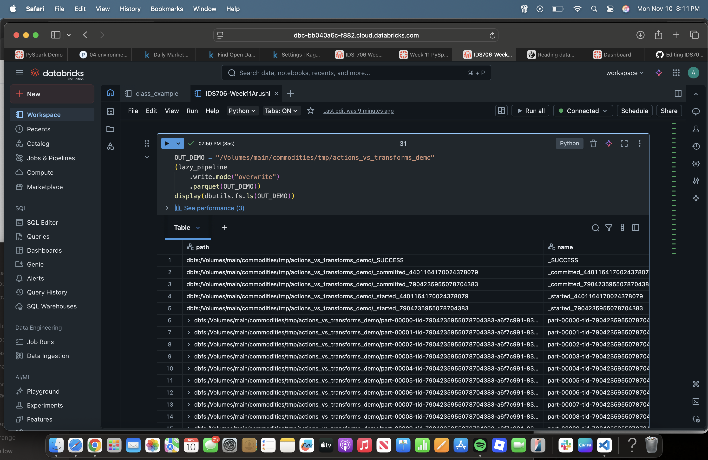
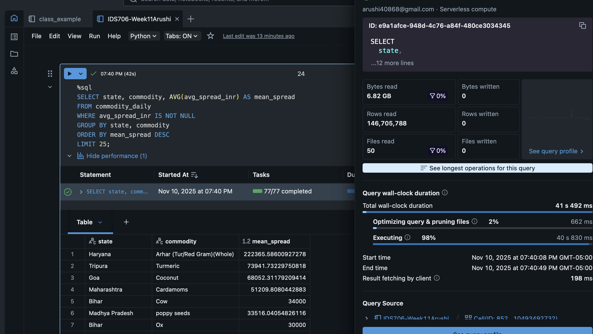
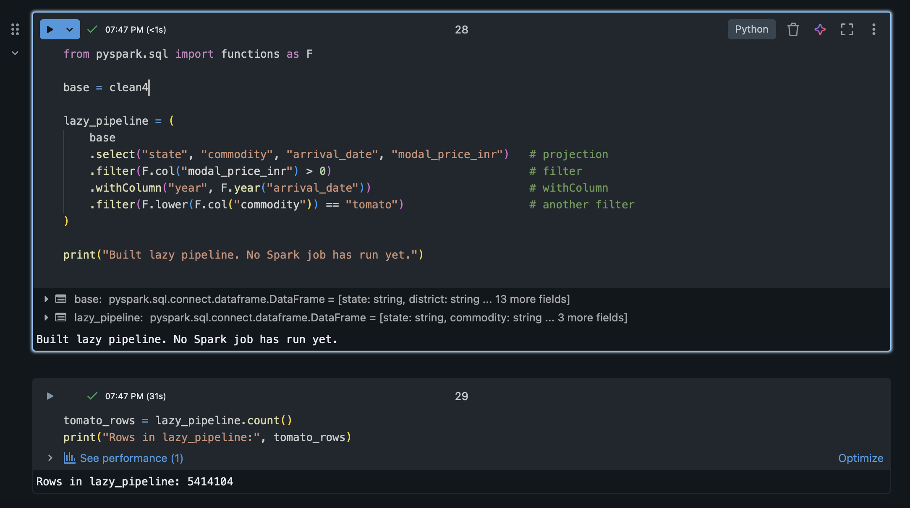

# Distributed Commodity Price Analytics using PySpark (Databricks + Unity Catalog)

**Author:** Arushi Singh  
**Platform:** Databricks (Serverless Compute, Unity Catalog)  
**Dataset:** [Daily Commodity Prices – India (Kaggle)](https://www.kaggle.com/datasets/khandelwalmanas/daily-commodity-prices-india)

---

## 🧠 Project Overview
This project builds a **PySpark data processing pipeline** demonstrating distributed data processing, lazy evaluation, and query optimization on a dataset >1 GB.  
It integrates **ETL**, **SQL analytics**, **performance tuning** and **lazy vs eager execution**.

---

## 🗂️ Dataset Description
- **Source:** Kaggle – *Daily Commodity Prices – India*  
- **Size:** > 1 GB combined (CSV + Parquet)  
- **Schema (simplified):**
  - `State`, `District`, `Market`, `Commodity`, `Variety`, `Grade`
  - `Arrival_Date`, `Min_Price`, `Max_Price`, `Modal_Price`
- Uploaded to a **Unity Catalog Volume** at:  
  `/Volumes/main/commodities/raw/`

---

## ⚙️ Data Processing Pipeline

### 1. Loading & Cleaning
- Read both **CSV** and **Parquet** files from UC Volumes.
- Normalized all columns → lowercase snake_case.
- Cast numeric columns to `double`, parsed dates, and handled missing values.

### 2. Transformations
- **Filters (2+):**
  - Removed rows with null `arrival_date`.
  - Kept only positive `min_price_inr` / `max_price_inr`.
- **withColumn:**
  - Created `price_spread_inr = max_price_inr - min_price_inr`.
  - Extracted `year` and `month` from `arrival_date`.
- **Join:**
  - Broadcast joined a state → region mapping to classify each record geographically.
- **GroupBy with Aggregations:**
  - Aggregated by `state, region, commodity, year, month` using:
    - `avg(modal_price_inr)`, `min(min_price_inr)`, `max(max_price_inr)`, `count(*)`.
- **Partitioned Write:**
  - Wrote curated output as Parquet partitioned by `year, state` to:
    `/Volumes/main/commodities/curated/daily_stats`



---

## ⚡ Query Optimization
| Strategy | Description |
|-----------|--------------|
| **Early Filters** | `arrival_date` ≠ NULL and positive prices applied before join/agg. |
| **Broadcast Join** | Region mapping broadcast to avoid shuffle joins. |
| **Column Pruning** | Parquet only reads required columns. |
| **Repartitioning** | Co-partitioned by `state, commodity` before aggregation to reduce skew. |
| **Partitioned Write** | Output partitioned by `year, state` for efficient downstream queries. |

### `.explain("formatted")`


### Spark UI / Query Details


---

## 📈 Performance Analysis

**Pushdown & Pruning:**  
Spark pushed filters on `arrival_date` and price fields into the Parquet scan, limiting I/O. Only projected columns (`state`, `commodity`, `modal_price_inr`) were loaded for groupBy and SQL queries.

**Shuffle Reduction:**  
By repartitioning on `(state, commodity)`, shuffle volume decreased. The BroadcastHashJoin node eliminated an entire exchange stage for the region lookup.

---

## 🧮 SQL Analytics

**Query 1 – Most Volatile Commodities (by avg price spread):**
```sql
SELECT state, commodity, AVG(avg_spread_inr) AS mean_spread
FROM commodity_daily
GROUP BY state, commodity
ORDER BY mean_spread DESC
LIMIT 25;
```


**Query 2 – Tomato Price Trend:**
```sql
SELECT year, month, state, AVG(avg_modal_inr) AS tomato_avg_inr
FROM commodity_daily
WHERE lower(commodity) = 'tomato'
GROUP BY year, month, state
ORDER BY year, month, state;
```


---

## 🧩 Actions vs Transformations

**Transformations (lazy):**
```python
lazy_df = (
  clean4
  .select("state","commodity","arrival_date","modal_price_inr")
  .filter(F.col("modal_price_inr") > 0)
  .withColumn("year", F.year("arrival_date"))
)
```
**Actions (eager):**
```python
lazy_df.count()       # triggers computation
lazy_df.collect()     # retrieves to driver
lazy_df.write.parquet("/Volumes/main/commodities/tmp/demo")  # persists results
```
Spark executed no job until an **action** occurred—visible in the UI.




---

## 🪶 Key Findings
- **Volatile commodities:** Onions, Tomatoes, Potatoes show highest price spread variance.
- **Regional trend:** South and West states exhibit more stable modal prices across months.
- **Temporal trend:** 2021–2023 saw a steady post-monsoon price rise in perishables.


---

## 📘 Takeaways
- Built a fully distributed ETL + Analytics pipeline on Spark Serverless.  
- Demonstrated **lazy evaluation**, **query optimization**, and **caching strategies** without direct `sparkContext` access.  
- Delivered reproducible Parquet outputs and SQL insights ready for dashboarding (e.g., Power BI / Tableau).

---
